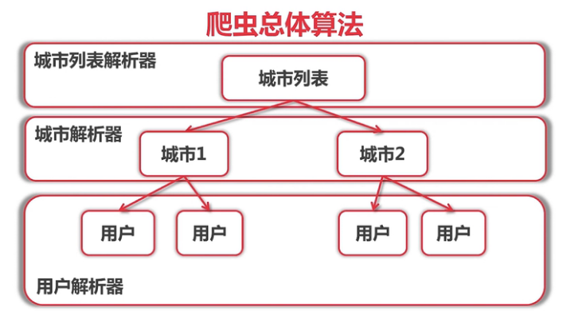
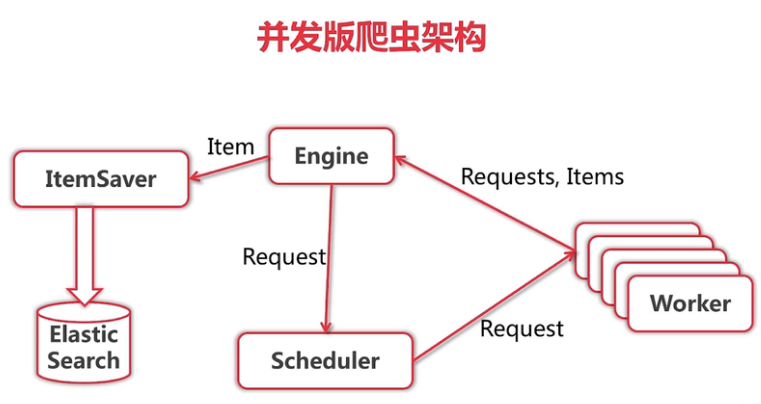
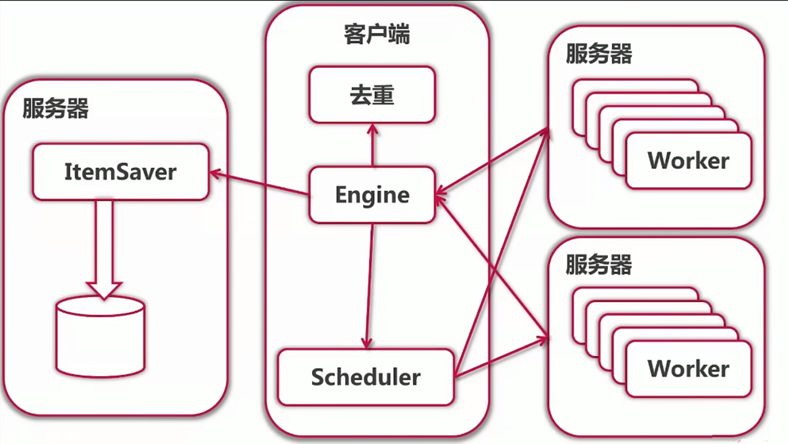
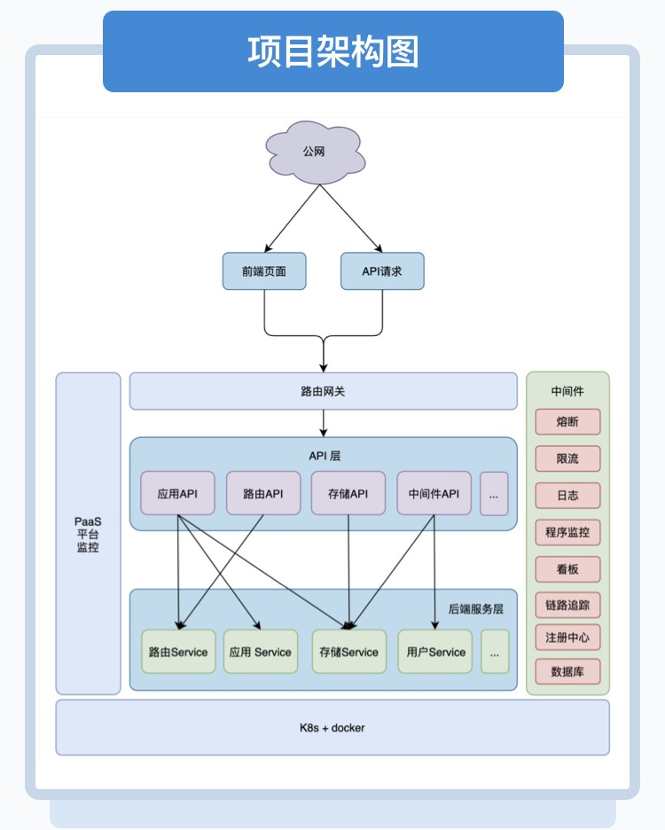

# Go Learn

熟悉Go相关语法使用：

- `jsonrpc` 目录下为 jsonrpc 的使用熟悉
- `crawler` 目录下是一个爬虫项目， `crawler-distributed` 是其分布式版本
- `micro-v3` 目录下是使用`go-micro`框架实现的pass平台，其下`server`目录为相关微服务，`docker`目录为依赖的中间件，`front`目录为前端页面

## Crawler

It's crawler website using Go language.

### Features

- Go language
- Docker
- Elastic Search
- MVC pattern
- Microservices
- Singleton -> Concurrent -> Distribute

### Installation and go packages

- go language
- docker
- elasticsearch
- go get golang.org/x/text
- go get -v github.com/gpmgo/gopm
- gopm get -g -v golang.org/x/text
- gopm get -g -v golang.org/x/net/html
- go get gopkg.in/olivere/elastic.v6

### Architecture

### Algorithm

### Framework

### Usage for Concurrent

- Start Docker.
- Run Script "docker run -d -p 9200:9200 elasticsearch:6.8.23"
- Run "crawler/main.go", to start the singleton crawler.
- Run "crawler/frontend/starter.go", to view the result in the website.
- Visit "http://localhost:8888/" in your browser
- Type in query string with REST format. such as "女 && Age>20"

### Usage for Distribute

- Start Docker.
- Run Script "docker run -d -p 9200:9200 elasticsearch"
- Open a Terminal, execute: crawler_distributed\persist\server>go run ItemSaver.go --port=1234
- Open a Terminal, execute: crawler_distributed\worker\server>go run worker.go --port=9000
- Open a Terminal, execute: crawler_distributed\worker\server>go run worker.go --port=9001
- Open a Terminal, execute: crawler_distributed>go run main.go --itemsaver_host=":1234" --worker_hosts=":9000,:9001"
- Run "crawler/frontend/starter.go", to view the result in the website.
- Visit "http://localhost:8888/" in your browser
- Type in query string with REST format. such as "男 && 已购车"

## Micro

项目启动步骤：

- 进入`./micro-v3/docker/compose` 执行 `docker-compose up -d`，进行consul配置和mysql库配置
- 进入`./micro-v3/docker/elk` 执行 `docker-compose -f docker-elk.yml up -d`
- 进入`server`目录下不同微服务，执行相应`Makefile`
- 启动网关：`docker run -d -p 8080:8080 cap1573/cap-api-gateway --registry=consul --registry_address=替换成注册中心地址:8500 api --handler=api`